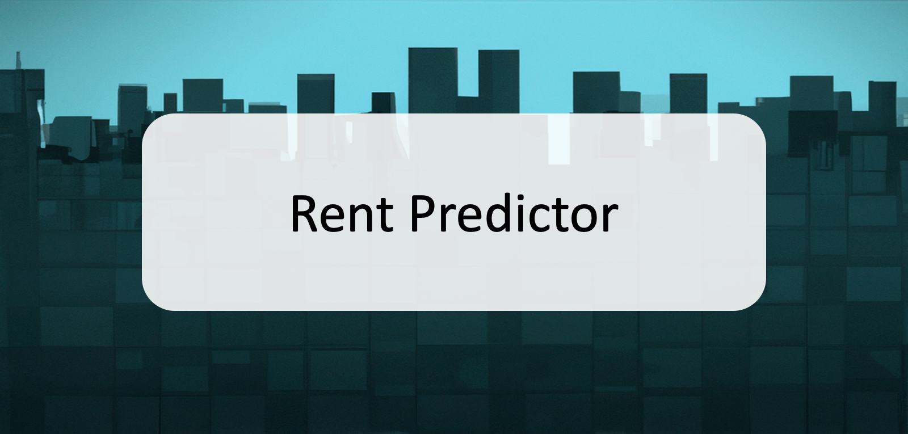
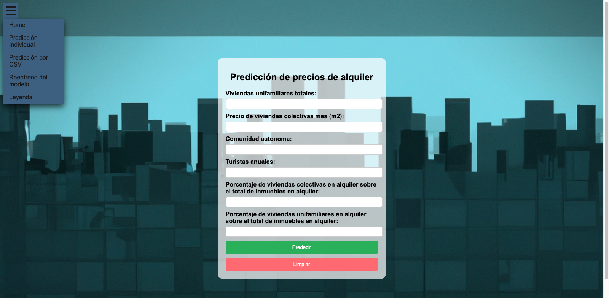
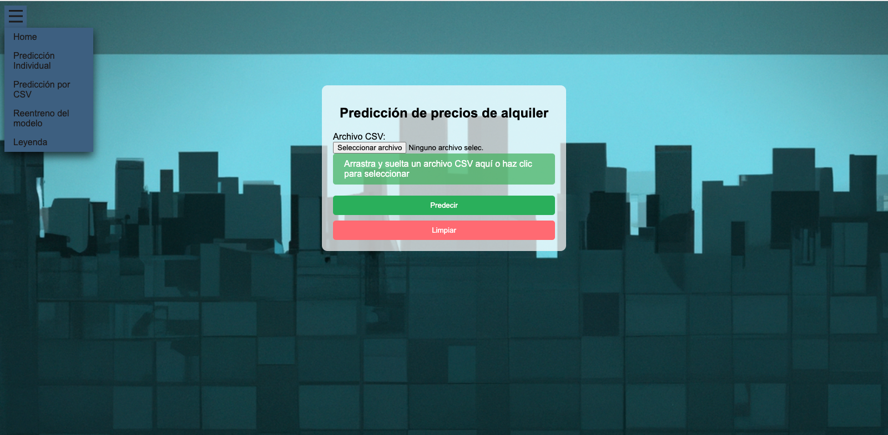
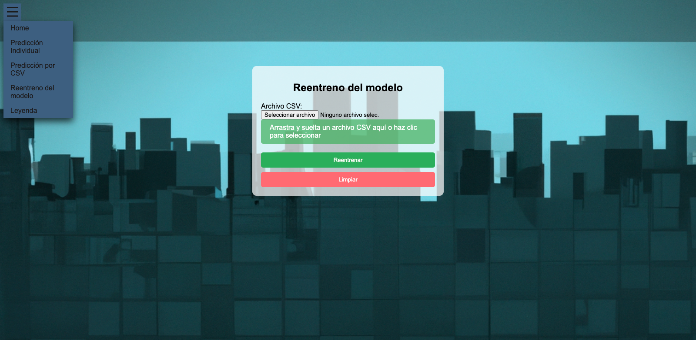
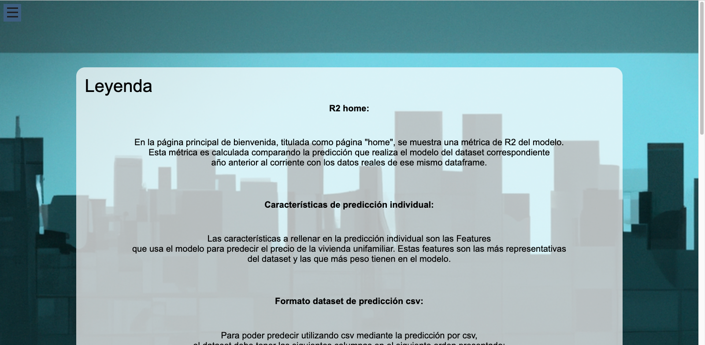

# Rent_predictor

  
  
## Introducción

Rent Predictos es una aplicación web que permite predecir el precio del alquiler medio por metro cuadrado de viviendas unifamiliares de cualquier localidad en España.  
  
Esta aplicación utiliza un modelo de aprendizage automático para predecir el target. Este modelo es seleccionado mediante un baseline de regresión logística donde se probaron todos estos modelos:  
  
> | Model                  |
> |------------------------|
> | Random Forest          |
> | GradientBoosting       |
> | XGBoost                |
> | AdaBoost               |
> | Polynomial Regression |
> | ElasticNet             |
> | KNeighborsRegressor   |
> | SuperVectorMachine     |  
  
Posteriormente se optimizarón los hiperparámetros del mejor modelo optenido del baseline mediante un GridSearchCV(). Este modelo fue entrenado con un dataset con las siguientes features:  
  
> | Features                         |
> |----------------------------------|
> | Total_vc                         |
> | Total_vu                         |
> | Alquiler_mes_vc_m2               |
> | Alquiler_mes_vu_m2               |
> | Poblacion                        |
> | Inmuebles_totales                |
> | Viviendas_turisticas             |
> | Turistas                         |
> | Porcentaje_viviendas_turisticas  |
> | Total_casas_alquiler             |
> | Porcentaje_viviendas_alquiler    |
> | Porcentaje_vc_alquiler           |
> | Porcentaje_vu_alquiler           |  
  
De las features anteriores, el modelo utiliza únicamente aquellas 6 que explican mejor el modelo.  
  
## Acceso a la app  
  
La app esta desplegada en **Azure**, puede acceder a ella desde el siguiente enlace:
  
### ["Rent-predictor"](http:rent-predictor.bcckc4c3dne4g8ec.westeurope.azurecontainer.io "Acceso a la app")  
  
## App  
  
La app consta de las siguientes páginas:  
  
> ### Home  
>   
> Pagina de inicio donde muestra una pequeña descripción de la app y el R2 del modelo. Este R2 se actualiza cada vez que se modifica el modelo.  

> ### Predicción individual 
>   
> Permite hacer una predicción rápida utilizando únicamente las 6 features que realmente utiliza el modelo. Estas columnas se actualizan cada vez que se modifica el modelo.  
  
> ### Predicción csv 
>   
> Permite hacer una predicción utilizando un csv con las localidades que se desean predecir. El csv debe tener la estructura que se describe en la página con la leyenda.  
  
> ### Reentreno
>   
> Permite reentrenar el modelo cuando se depreque sin necesidad de que la página deje de dar servicio. El dataframe para reentrenar el modelo debe de seguir la estructura que se describe en la página con la leyenda.  

> ### Leyenda
>   
> Aporta toda la información que requiere el usuario para poder utilizar la app.  
  
## Estructura de carpetas  
  
- src
    - app
        - data
            - env
            - img
            - model
            - templates
            - utils
    - data
        - raw
        - processed
    - img
    - models
    - utils  
  
## Ejecución en local  
  
Se debe colocar un terminal en la carpeta app, activar el entorno virtual "env" y escribir el siguiente código:  
  
```bash
uvicorn app:app --port 8080
```  
  
## Autor  
  
### [José Manuel González Fornell](https://github.com/josemanuelgonzalezfornell)
